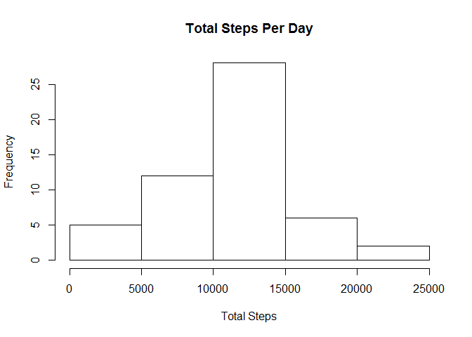
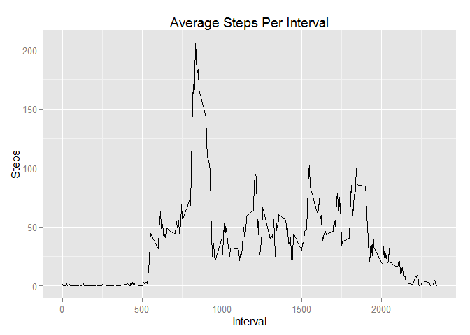
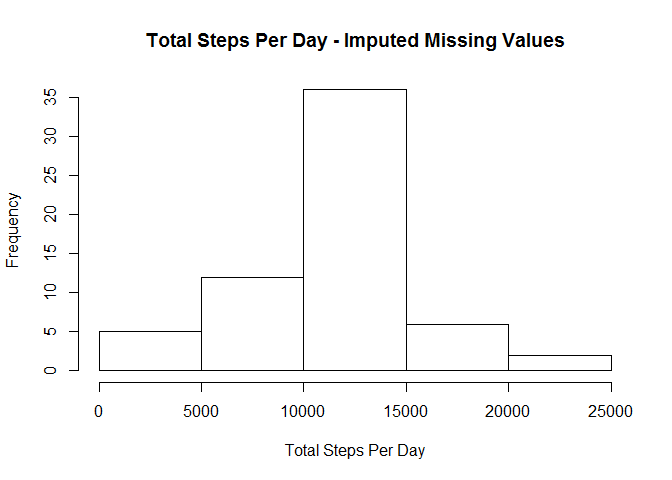
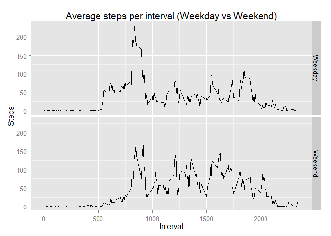

# Reproducible Research: Peer Assessment 1

## Loading and preprocessing the data

```r
unzip("repdata-data-activity.zip")
activity <- read.csv("activity.csv", header = T, sep = ",")
```

## What is mean total number of steps taken per day?

```r
allactivity <- activity[complete.cases(activity),]
totalsteps <- function(data) {
        stepsperday <- aggregate(data$steps, list(Date = data$date), FUN = sum)
        names(stepsperday) <- c("Date", "Steps")
        stepsperday
}
allstepsperday <- totalsteps(allactivity)
hist(allstepsperday$Steps, main = "Total Steps Per Day",
     xlab = "Total Steps")
```

 


```r
stepsmean <- mean(allstepsperday$Steps)
stepsmedian <- median(allstepsperday$Steps)
```
The **mean** total number of steps per day is **10766**.
The **median** total number of steps per day is **10765**.

## What is the average daily activity pattern?

```r
library(ggplot2)
```

```
## Warning: package 'ggplot2' was built under R version 3.1.1
```

```r
intervalavgsteps <- aggregate(allactivity$steps,
                              list(Interval = allactivity$interval), FUN = mean)
names(intervalavgsteps) <- c("Interval", "Steps")
qplot(Interval, Steps, data = intervalavgsteps, geom = "line",
      main = "Average Steps Per Interval")
```

 


```r
intervalmaxsteps <- intervalavgsteps[intervalavgsteps$Steps == max(intervalavgsteps$Steps),1]
```
The interval **835** contains the maximum number of steps.

## Imputing missing values

```r
rowsmissing <- nrow(activity) - nrow(allactivity)
```
There are **2304** rows with missing values in the dataset.

Do missing days may introduce bias into some calculations or summaries of the data?


```r
imputedactivity <- activity
imputedactivity <- merge(imputedactivity, intervalavgsteps,
                         by.x = "interval", by.y = "Interval", all.y = T)
imputedactivity <- within(imputedactivity, {
        steps <- ifelse(is.na(steps), Steps, steps)
})
imputedactivity <- imputedactivity[, 1:3]
imputedallstepsperday <- totalsteps(imputedactivity)
hist(imputedallstepsperday$Steps,
     main = "Total Steps Per Day - Imputed Missing Values",
     xlab = "Total Steps Per Day")
```

 


```r
imputedstepsmean <- mean(imputedallstepsperday$Steps)
imputedstepsmedian <- median(imputedallstepsperday$Steps)
```
The **mean** total number of steps per day now is **10766**.
The **median** total number of steps per day now is **10766**.

These values do not seem to differ from the estimates from the first part of the assignment. There does not seem to be any impact of imputing missing data on the estimates of the total daily number of steps.

## Are there differences in activity patterns between weekdays and weekends?

```r
weekday <- function(date.string) {
        weekday <- weekdays(as.Date(date.string, "%Y-%m-%d"), abbreviate = T)
        ifelse(weekday == "Sun" | weekday == "Sat", "Weekend", "Weekday")
}
imputedactivity$Weekday <- weekday(as.character(imputedactivity$date))
stepsweekly <- aggregate(imputedactivity$steps,
                         list(Interval = imputedactivity$interval, Weekday = imputedactivity$Weekday),
                         FUN = mean)
names(stepsweekly) <- c("Interval", "Weekday", "Steps")
qplot(Interval, Steps, data = stepsweekly, facets = Weekday ~ ., geom = "line",
      main = "Average steps per interval (Weekday vs Weekend)")
```

 

There are differences in weekday vs weekend, in that weekend steps are relatively higher throughout the day.Weekday steps ahve the highest overall in the morning.       
